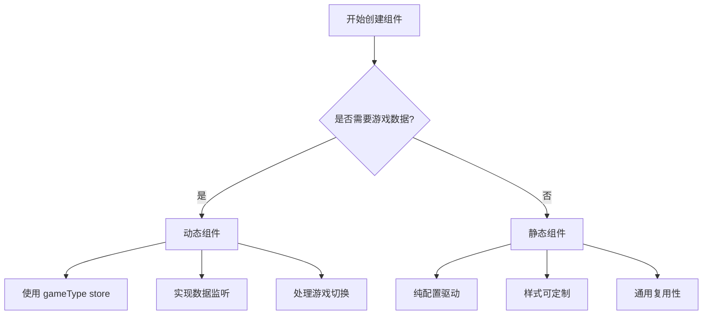

# WebVision 组件开发代码风格规范

> 基于 CommoditySearch 组件的标准代码风格，所有 WebVision 组件开发都应遵循此规范

## 📋 目录

- [组件分类与选择](#组件分类与选择)
- [静态组件开发](#静态组件开发)
- [动态组件开发](#动态组件开发)
- [文件结构规范](#文件结构规范)
- [主组件代码模板](#主组件代码模板)
- [配置组件代码模板](#配置组件代码模板)
- [类型定义模板](#类型定义模板)
- [关键代码风格要点](#关键代码风格要点)
- [开发检查清单](#开发检查清单)

## 🎯 组件分类与选择

### 组件类型定义

WebVision 组件分为两大类：**静态组件**和**动态组件**

#### 静态组件 (Static Components)

- **定义**：纯展示型组件，不依赖游戏类型数据
- **特点**：配置驱动、样式可定制、通用性强
- **适用场景**：导航栏、文本展示、图片展示、布局组件、广告组件等
- **示例**：`BlankArea`、`CaptionText`、`TopNavBar`、`CustomBox`

#### 动态组件 (Dynamic Components)

- **定义**：依赖游戏类型的数据驱动组件
- **特点**：与 gameType store 深度集成、数据动态变化、业务逻辑复杂
- **适用场景**：游戏结果展示、期数列表、预测组件、游戏相关数据展示
- **示例**：`GameResultBox`、`Issue24`、`IssueList`、`ImageGameTypeCards`

### 如何选择组件类型



### 组件选择决策表

| 判断条件            | 静态组件 | 动态组件 |
| ------------------- | -------- | -------- |
| 需要游戏数据        | ❌       | ✅       |
| 依赖 gameType store | ❌       | ✅       |
| 内容随游戏变化      | ❌       | ✅       |
| 纯展示功能          | ✅       | ❌       |
| 配置驱动            | ✅       | 部分     |
| 业务逻辑复杂        | ❌       | ✅       |

## 🔧 静态组件开发

### 静态组件特点

- **配置驱动**：所有内容和样式通过 `datas.configParamJson` 配置
- **样式可定制**：支持完整的样式自定义
- **通用复用**：不依赖特定业务逻辑，可在多种场景使用
- **响应式设计**：适配移动端和桌面端

### 静态组件模板

```vue
<template>
  <div class="StaticComponent">
    <div
      class="static-component-content"
      :style="containerStyle"
      v-if="datas.configParamJson.enable"
    >
      <!-- 标题区域 -->
      <div
        v-if="datas.configParamJson.title"
        class="title-header"
        :style="titleHeaderStyle"
      >
        <h2
          class="main-title"
          :style="mainTitleStyle"
        >
          {{ datas.configParamJson.title }}
        </h2>
        <span
          v-if="datas.configParamJson.subtitle"
          class="sub-title"
          :style="subTitleStyle"
        >
          {{ datas.configParamJson.subtitle }}
        </span>
      </div>

      <!-- 内容区域 -->
      <div
        class="content-area"
        :style="contentStyle"
      >
        {{ datas.configParamJson.content }}
      </div>
    </div>

    <!-- 必需的删除按钮插槽 -->
    <slot name="deles" />
  </div>
</template>

<script setup lang="ts" name="StaticComponent">
import { computed } from 'vue'
import type { IDatas } from './type'

interface IProps {
  datas: IDatas
}
const props = defineProps<IProps>()

// 样式计算 - 静态组件标准模式
const styleHeader = computed(() => props.datas.configParamJson.styleHeader)
const styleMain = computed(() => props.datas.configParamJson.styleMain)

const containerStyle = computed(() => ({
  backgroundColor: styleMain.value?.backgroundColor || '#ffffff',
  borderRadius: `${styleMain.value?.borderRadius || 0}px`,
  padding: `${styleMain.value?.padding || 16}px`,
  margin: `${styleMain.value?.margin || 0}px`,
  boxShadow: styleMain.value?.boxShadow || 'none'
}))

const titleHeaderStyle = computed(() => {
  if (styleHeader.value?.isGradient) {
    return {
      background: `linear-gradient(to right, ${styleHeader.value.headerBg}, ${styleHeader.value.headerBg2})`
    }
  }
  return {
    backgroundColor: styleHeader.value?.headerBgColor || '#4a90e2'
  }
})

const mainTitleStyle = computed(() => ({
  color: styleHeader.value?.titleColor || '#ffffff',
  fontSize: `${styleHeader.value?.titleSize || 18}px`,
  fontWeight: styleHeader.value?.titleWeight || 'bold'
}))

const subTitleStyle = computed(() => ({
  color: styleHeader.value?.subTitleColor || '#ffffff',
  fontSize: `${styleHeader.value?.subTitleSize || 14}px`
}))

const contentStyle = computed(() => ({
  color: styleMain.value?.textColor || '#333333',
  fontSize: `${styleMain.value?.fontSize || 14}px`,
  textAlign: styleMain.value?.textAlign || 'center',
  lineHeight: styleMain.value?.lineHeight || '1.5'
}))
</script>

<style scoped lang="scss">
.StaticComponent {
  position: relative;

  .static-component-content {
    // 动态样式通过 computed 属性控制
  }

  .title-header {
    padding: 12px 16px;
    border-radius: 8px 8px 0 0;
    display: flex;
    align-items: center;
    justify-content: space-between;

    .main-title {
      margin: 0;
    }

    .sub-title {
      opacity: 0.9;
    }
  }

  .content-area {
    padding: 16px;
    min-height: 60px;
    word-wrap: break-word;
    white-space: pre-wrap;
  }

  // 响应式设计
  @media (max-width: 768px) {
    .title-header {
      padding: 8px 12px;
      flex-direction: column;
      align-items: flex-start;
      gap: 4px;
    }

    .content-area {
      padding: 12px;
    }
  }
}
</style>
```

## ⚡ 动态组件开发

### 动态组件特点

- **gameType 集成**：与 gameType store 深度集成
- **数据驱动**：内容根据游戏类型动态变化
- **实时更新**：监听游戏类型变化，自动更新内容
- **业务逻辑**：包含复杂的游戏业务逻辑
- **配置面板**：包含 gameType 选择器和相关配置项

### gameType Store 集成模式

```typescript
// 1. 导入 gameType store
import { gameStore } from '../store/index'
import { useStore } from '@nanostores/vue'

// 2. 使用 store
const gameStoreData = useStore(gameStore)
const gameType = computed(() => gameStoreData.value.gameType)
const currentGame = computed(() => gameStoreData.value.currentGame)

// 3. 响应式参数对象，与配置同步
const componentParams = reactive({
  gameType: props.datas.configParamJson.gameType || gameType.value,
  size: props.datas.configParamJson.size || 10,
  forumId: props.datas.configParamJson.forumId || '10'
})

// 4. 监听游戏类型变化
watch(
  gameType,
  (newGameType) => {
    if (newGameType) {
      componentParams.gameType = newGameType
      fetchGameData(newGameType)
    }
  },
  { immediate: true }
)

// 5. 监听组件配置变化
watch(
  () => [props.datas.configParamJson.gameType, props.datas.configParamJson.size],
  ([newGameType, newSize]) => {
    if (newGameType) componentParams.gameType = newGameType
    if (newSize) componentParams.size = Number(newSize)

    if (newGameType) fetchGameData(newGameType)
  },
  { deep: true }
)
```

### 动态组件配置面板模式

```vue
<template>
  <div class="DynamicComponentStyle">
    <h2>{{ datas.componentName }}</h2>
    <el-form
      label-width="auto"
      ref="ruleFormRef"
      :model="datas"
      :rules="rules"
      class="lef"
    >
      <!-- 基础组件配置 -->
      <share-component :datas="datas" />
      <componentHeadTitle :datas="datas" />
      <header-title :datas="datas" />

      <!-- 游戏类型选择配置 - 动态组件必需 -->
      <StoreGameTypeList :datas="datas" />

      <!-- 动态组件特有配置 -->
      <el-form-item
        label="数据条数"
        prop="size"
      >
        <el-input-number
          v-model="datas.configParamJson.size"
          :min="1"
          :max="50"
        />
      </el-form-item>

      <el-form-item
        label="论坛ID"
        prop="forumId"
      >
        <el-input v-model="datas.configParamJson.forumId" />
      </el-form-item>

      <!-- 其他样式配置... -->
    </el-form>
  </div>
</template>

<script setup lang="ts" name="DynamicComponentStyle">
import StoreGameTypeList from '@/views/WebVision/components/rightslider/StoreGameTypeList/index.vue'
// ... 其他导入
</script>
```

### 动态组件模板

```vue
<template>
  <div class="DynamicComponent">
    <div
      class="dynamic-component-content"
      :style="containerStyle"
      v-if="datas.configParamJson.enable"
    >
      <!-- 标题区域 - 支持动态游戏名称 -->
      <div
        v-if="datas.configParamJson.title"
        class="title-header"
        :style="titleHeaderStyle"
      >
        <h2
          class="main-title"
          :style="mainTitleStyle"
        >
          {{ datas.configParamJson.title }} - {{ currentGameName }}
        </h2>
        <span
          v-if="datas.configParamJson.subtitle"
          class="sub-title"
          :style="subTitleStyle"
        >
          {{ datas.configParamJson.subtitle }}
        </span>
      </div>

      <!-- 动态内容区域 -->
      <div
        class="content-area"
        :style="contentStyle"
      >
        <!-- 加载状态 -->
        <div
          v-if="loading"
          class="loading-state"
        >
          <el-icon class="is-loading"><Loading /></el-icon>
          <span>正在加载{{ currentGameName }}数据...</span>
        </div>

        <!-- 数据展示 -->
        <div
          v-else-if="gameData && gameData.length > 0"
          class="game-data-list"
        >
          <div
            v-for="(item, index) in gameData"
            :key="item.id || index"
            class="game-data-item"
            :style="itemStyle"
          >
            <!-- 根据游戏类型渲染不同内容 -->
            <template v-if="gameType === 'lottery'">
              <div class="lottery-content">
                <span class="issue">{{ item.issue }}期</span>
                <span class="result">{{ item.result }}</span>
              </div>
            </template>

            <template v-else-if="gameType === 'prediction'">
              <div class="prediction-content">
                <span class="title">{{ item.title }}</span>
                <span class="prediction">{{ item.prediction }}</span>
              </div>
            </template>

            <template v-else>
              <div class="default-content">
                {{ item.content || item.title }}
              </div>
            </template>
          </div>
        </div>

        <!-- 空状态 -->
        <div
          v-else
          class="empty-state"
        >
          <el-empty description="暂无游戏数据" />
        </div>
      </div>
    </div>

    <!-- 必需的删除按钮插槽 -->
    <slot name="deles" />
  </div>
</template>

<script setup lang="ts" name="DynamicComponent">
import { computed, ref, watch, onMounted } from 'vue'
import { Loading } from '@element-plus/icons-vue'
import { useStore } from '@nanostores/vue'
import { gameStore } from '../store/index'
import type { IDatas } from './type'

interface IProps {
  datas: IDatas
}
const props = defineProps<IProps>()

// gameType Store 集成
const gameStoreData = useStore(gameStore)
const gameType = computed(() => gameStoreData.value.gameType)
const currentGame = computed(() => gameStoreData.value.currentGame)
const currentGameName = computed(() => currentGame.value?.name || '未知游戏')

// 组件状态
const loading = ref(false)
const gameData = ref([])
const error = ref(null)

// 样式计算
const styleHeader = computed(() => props.datas.configParamJson.styleHeader)
const styleMain = computed(() => props.datas.configParamJson.styleMain)

const containerStyle = computed(() => ({
  backgroundColor: styleMain.value?.backgroundColor || '#ffffff',
  borderRadius: `${styleMain.value?.borderRadius || 0}px`,
  padding: `${styleMain.value?.padding || 16}px`,
  margin: `${styleMain.value?.margin || 0}px`
}))

const titleHeaderStyle = computed(() => {
  if (styleHeader.value?.isGradient) {
    return {
      background: `linear-gradient(to right, ${styleHeader.value.headerBg}, ${styleHeader.value.headerBg2})`
    }
  }
  return {
    backgroundColor: styleHeader.value?.headerBgColor || '#4a90e2'
  }
})

const mainTitleStyle = computed(() => ({
  color: styleHeader.value?.titleColor || '#ffffff'
}))

const subTitleStyle = computed(() => ({
  color: styleHeader.value?.subTitleColor || '#ffffff'
}))

const contentStyle = computed(() => ({
  color: styleMain.value?.textColor || '#333333',
  fontSize: `${styleMain.value?.fontSize || 14}px`
}))

const itemStyle = computed(() => ({
  borderColor: styleMain.value?.borderColor || '#e0e0e0',
  backgroundColor: styleMain.value?.itemBgColor || '#f9f9f9'
}))

// 数据获取函数
const fetchGameData = async (gameType: string) => {
  if (!gameType) return

  loading.value = true
  error.value = null

  try {
    // 根据游戏类型获取不同的数据
    let response
    switch (gameType) {
      case 'lottery':
        response = await fetchLotteryData()
        break
      case 'prediction':
        response = await fetchPredictionData()
        break
      default:
        response = await fetchDefaultGameData(gameType)
    }

    gameData.value = response.data || []
  } catch (err) {
    error.value = err
    console.error('获取游戏数据失败:', err)
  } finally {
    loading.value = false
  }
}

// 具体的数据获取函数
const fetchLotteryData = async () => {
  // 实现彩票数据获取逻辑
  return { data: [] }
}

const fetchPredictionData = async () => {
  // 实现预测数据获取逻辑
  return { data: [] }
}

const fetchDefaultGameData = async (gameType: string) => {
  // 实现默认游戏数据获取逻辑
  return { data: [] }
}

// 监听游戏类型变化
watch(
  gameType,
  (newGameType) => {
    if (newGameType) {
      fetchGameData(newGameType)
    }
  },
  { immediate: true }
)

// 监听游戏切换
watch(currentGame, (newGame) => {
  if (newGame) {
    fetchGameData(newGame.type)
  }
})

onMounted(() => {
  // 组件挂载时获取初始数据
  if (gameType.value) {
    fetchGameData(gameType.value)
  }
})
</script>

<style scoped lang="scss">
.DynamicComponent {
  position: relative;

  .dynamic-component-content {
    // 动态样式通过 computed 属性控制
  }

  .title-header {
    padding: 12px 16px;
    border-radius: 8px 8px 0 0;
    display: flex;
    align-items: center;
    justify-content: space-between;

    .main-title {
      margin: 0;
      font-size: 18px;
      font-weight: bold;
    }

    .sub-title {
      font-size: 14px;
      opacity: 0.9;
    }
  }

  .content-area {
    padding: 16px;
    min-height: 120px;

    .loading-state {
      display: flex;
      align-items: center;
      justify-content: center;
      gap: 8px;
      padding: 40px;
      color: #666;
    }

    .game-data-list {
      display: flex;
      flex-direction: column;
      gap: 8px;

      .game-data-item {
        padding: 12px;
        border: 1px solid #e0e0e0;
        border-radius: 6px;
        transition: all 0.3s ease;

        &:hover {
          border-color: #4a90e2;
          box-shadow: 0 2px 8px rgba(74, 144, 226, 0.1);
        }

        .lottery-content {
          display: flex;
          justify-content: space-between;
          align-items: center;

          .issue {
            font-weight: 600;
            color: #4a90e2;
          }

          .result {
            font-size: 16px;
            font-weight: bold;
            color: #e74c3c;
          }
        }

        .prediction-content {
          display: flex;
          flex-direction: column;
          gap: 4px;

          .title {
            font-weight: 600;
            color: #333;
          }

          .prediction {
            color: #666;
            font-size: 14px;
          }
        }

        .default-content {
          color: #333;
        }
      }
    }

    .empty-state {
      display: flex;
      align-items: center;
      justify-content: center;
      padding: 40px;
    }
  }

  // 响应式设计
  @media (max-width: 768px) {
    .title-header {
      padding: 8px 12px;
      flex-direction: column;
      align-items: flex-start;
      gap: 4px;
    }

    .content-area {
      padding: 12px;

      .game-data-item {
        padding: 8px;

        .lottery-content {
          flex-direction: column;
          align-items: flex-start;
          gap: 4px;
        }
      }
    }
  }
}
</style>
```

## 🏗️ 文件结构规范

### 重要：文件名大小写规范

- 组件文件夹：**帕斯卡命名法**（如：`CommoditySearch`）
- 主组件文件：`index.vue`
- 类型定义文件：`type.ts`
- 配置组件文件：`{组件名}Style/index.vue`（必须以 `Style` 后缀结尾）

### 标准目录结构

```
src/views/WebVision/components/
├── componentsbiz/
│   ├── CommoditySearch/           # 组件文件夹（帕斯卡命名）
│   │   ├── index.vue             # 主组件
│   │   └── type.ts               # 类型定义
│   └── OtherComponent/           # 其他组件
└── rightslider/
    ├── CommoditySearchStyle/     # 配置组件（组件名+Style）
    │   └── index.vue
    └── OtherComponentStyle/      # 其他配置组件
```

## 📋 主组件代码模板

### 完整的 index.vue 模板

```vue
<template>
  <div class="ComponentName">
    <div
      class="componentname-content"
      :style="containerStyle"
      v-if="datas.configParamJson.enable"
    >
      <!-- 标题区域 -->
      <div
        v-if="datas.configParamJson.title"
        class="title-header"
        :style="titleHeaderStyle"
      >
        <h2
          class="main-title"
          :style="mainTitleStyle"
        >
          {{ datas.configParamJson.title }}
        </h2>
        <span
          v-if="datas.configParamJson.subtitle"
          class="sub-title"
          :style="subTitleStyle"
        >
          {{ datas.configParamJson.subtitle }}
        </span>
      </div>

      <!-- 组件主要内容区域 -->
      <div class="main-container">
        <!-- 具体组件内容 -->
      </div>
    </div>

    <!-- 删除按钮插槽 - 必须包含 -->
    <slot name="deles" />
  </div>
</template>

<script setup lang="ts" name="ComponentName">
import { computed } from 'vue'
import type { IDatas } from './type'

interface IProps {
  datas: IDatas
}
const props = defineProps<IProps>()

// 样式计算属性
const styleHeader = computed(() => props.datas.configParamJson.styleHeader)
const styleMain = computed(() => props.datas.configParamJson.styleMain)

// 容器样式 - 标准模式
const containerStyle = computed(() => {
  return {
    backgroundColor: styleMain.value?.backgroundColor || '#f8f9fa',
    borderRadius: `${styleMain.value?.borderRadius || 0}px`,
    padding: `${styleMain.value?.containerPadding || 12}px`,
    margin: `${styleMain.value?.margin || 5}px auto`,
    boxShadow: styleMain.value?.boxShadow || 'none'
  }
})

// 标题头部样式 - 支持渐变
const titleHeaderStyle = computed(() => {
  if (styleHeader.value.isGradient) {
    return {
      background: `linear-gradient(to right, ${styleHeader.value.headerBg}, ${styleHeader.value.headerBg2})`
    }
  } else {
    return {
      backgroundColor: styleHeader.value?.headerBgColor || '#4a90e2'
    }
  }
})

const mainTitleStyle = computed(() => {
  return {
    color: styleHeader.value?.titleColor || '#ffffff'
  }
})

const subTitleStyle = computed(() => {
  return {
    color: styleHeader.value?.subTitleColor || '#ffffff'
  }
})

// 事件处理函数
const handleClick = () => {
  console.log('组件点击事件')
}
</script>

<style lang="scss" scoped>
.ComponentName {
  position: relative;
}

.componentname-content {
  // 使用计算样式，避免写死样式
}

.title-header {
  padding: 12px 16px;
  border-radius: 8px;
  display: flex;
  align-items: center;
  justify-content: space-between;

  .main-title {
    margin: 0;
    font-size: 18px;
    font-weight: bold;
  }

  .sub-title {
    font-size: 14px;
    opacity: 0.9;
  }
}

.main-container {
  // 主要内容区域样式
}

// 响应式设计 - 必须支持移动端
@media (max-width: 768px) {
  .main-container {
    // 移动端适配
  }
}
</style>
```

## 🔧 配置组件代码模板

### 完整的 ComponentNameStyle/index.vue 模板

```vue
<template>
  <div class="ComponentNameStyle">
    <h2>{{ datas.componentName }}</h2>
    <el-form
      :model="datas.configParamJson"
      :rules="rules"
      ref="ruleFormRef"
      class="component-name-style"
    >
      <!-- 必须包含的三个基础组件 -->
      <share-component :datas="datas" />
      <componentHeadTitle :datas="datas" />
      <header-title :datas="datas" />

      <!-- 基础设置区域 -->
      <el-divider content-position="left">基础设置</el-divider>

      <el-form-item label="启用状态">
        <el-switch v-model="datas.configParamJson.enable" />
      </el-form-item>

      <el-form-item label="组件高度">
        <el-slider
          v-model="datas.configParamJson.heights"
          :min="30"
          :max="100"
          show-input
        />
      </el-form-item>

      <el-form-item label="文本位置">
        <el-radio-group v-model="datas.configParamJson.textPosition">
          <el-radio
            v-for="option in positionOptions"
            :key="option.value"
            :label="option.value"
          >
            {{ option.label }}
          </el-radio>
        </el-radio-group>
      </el-form-item>

      <!-- 快速配置区域 -->
      <el-divider content-position="left">快速配置</el-divider>

      <div class="preset-configs">
        <el-button-group>
          <el-button
            v-for="preset in presetConfigs"
            :key="preset.name"
            size="small"
            @click="applyPresetConfig(preset)"
          >
            {{ preset.name }}
          </el-button>
        </el-button-group>
      </div>

      <!-- 样式设置区域 -->
      <el-divider content-position="left">样式设置</el-divider>

      <el-row :gutter="16">
        <el-col :span="12">
          <el-form-item label="背景色">
            <el-color-picker
              v-model="datas.configParamJson.backgroundColor"
              show-alpha
            />
          </el-form-item>
        </el-col>
        <el-col :span="12">
          <el-form-item label="文字颜色">
            <el-color-picker
              v-model="datas.configParamJson.textColor"
              show-alpha
            />
          </el-form-item>
        </el-col>
      </el-row>

      <el-form-item label="圆角大小">
        <el-slider
          v-model="datas.configParamJson.borderRadius"
          :min="0"
          :max="30"
          show-input
        />
      </el-form-item>

      <!-- 动态配置项管理（可选） -->
      <el-divider content-position="left">配置项管理</el-divider>

      <div class="config-management">
        <div class="config-header">
          <el-button
            type="primary"
            size="small"
            @click="addConfigItem"
          >
            <el-icon><Plus /></el-icon>
            添加配置项
          </el-button>
        </div>

        <div class="config-list">
          <vuedraggable
            :list="datas.configParamJson.configItems"
            item-key="id"
            :animation="200"
            handle=".drag-handle"
          >
            <template #item="{ element, index }">
              <div class="config-item">
                <div class="config-row">
                  <div class="drag-handle">
                    <el-icon><More /></el-icon>
                  </div>
                  <el-input
                    v-model="element.text"
                    placeholder="配置项内容"
                    style="flex: 1; margin-right: 8px"
                  />
                  <el-switch
                    v-model="element.enabled"
                    inline-prompt
                    active-text="显示"
                    inactive-text="隐藏"
                    style="margin-right: 8px"
                  />
                  <el-button
                    type="danger"
                    size="small"
                    @click="deleteConfigItem(index)"
                  >
                    <el-icon><Delete /></el-icon>
                  </el-button>
                </div>
              </div>
            </template>
          </vuedraggable>
        </div>
      </div>
    </el-form>
  </div>
</template>

<script setup lang="ts" name="ComponentNameStyle">
import { ref } from 'vue'
import shareComponent from '@/views/WebVision/components/rightslider/shareComponent/index.vue'
import componentHeadTitle from '@/views/WebVision/components/rightslider/componentHeadTitle/index.vue'
import headerTitle from '@/views/WebVision/components/rightslider/headerTitle/index.vue'
import type { FormInstance } from 'element-plus'
import { Delete, Plus, More } from '@element-plus/icons-vue'
import type { IDatas } from '@/views/WebVision/components/componentsbiz/ComponentName/type'
import { ElMessage } from 'element-plus'
import vuedraggable from 'vuedraggable'

interface IProps {
  datas: IDatas
}
const props = defineProps<IProps>()

const rules = ref({})
const ruleFormRef = ref<FormInstance>()

// 生成唯一ID - 标准工具函数
const generateId = () => {
  return Date.now().toString(36) + Math.random().toString(36).substr(2)
}

// 添加配置项
const addConfigItem = () => {
  const newConfigItem = {
    id: generateId(),
    text: '新配置项',
    enabled: true,
    order: props.datas.configParamJson.configItems.length + 1
  }
  props.datas.configParamJson.configItems.push(newConfigItem)
}

// 删除配置项
const deleteConfigItem = (index: number) => {
  if (props.datas.configParamJson.configItems.length <= 1) {
    ElMessage.warning('至少保留一个配置项')
    return
  }
  props.datas.configParamJson.configItems.splice(index, 1)
  // 重新排序
  props.datas.configParamJson.configItems.forEach((item, idx) => {
    item.order = idx + 1
  })
}

// 位置选项 - 标准配置
const positionOptions = [
  { value: 0, label: '居左' },
  { value: 1, label: '居中' },
  { value: 2, label: '居右' }
]

// 预设配置 - 提供快速配置选项
const presetConfigs = [
  {
    name: '简约风格',
    config: {
      borderRadius: 20,
      backgroundColor: '#ffffff',
      borderColor: '#e0e0e0'
    }
  },
  {
    name: '现代风格',
    config: {
      borderRadius: 8,
      backgroundColor: '#f8f9fa',
      borderColor: '#ddd'
    }
  },
  {
    name: '经典风格',
    config: {
      borderRadius: 4,
      backgroundColor: '#ffffff',
      borderColor: '#ccc'
    }
  }
]

// 应用预设配置
const applyPresetConfig = (preset: any) => {
  Object.assign(props.datas.configParamJson, preset.config)
}
</script>

<style lang="scss" scoped>
.ComponentNameStyle {
  .component-name-style {
    padding: 0 10px;
  }

  h2 {
    padding: 24px 16px 24px 0;
    margin-bottom: 15px;
    border-bottom: 1px solid #f2f4f6;
    font-size: 18px;
    font-weight: 600;
    color: #323233;
  }

  .preset-configs {
    margin-bottom: 16px;
  }

  .config-management {
    .config-header {
      margin-bottom: 12px;
    }

    .config-list {
      .config-item {
        margin-bottom: 8px;
        padding: 12px;
        border: 1px solid #e4e7ed;
        border-radius: 4px;
        background-color: #f9f9f9;

        .config-row {
          display: flex;
          align-items: center;
          gap: 8px;

          .drag-handle {
            cursor: move;
            color: #999;
            padding: 4px;
          }
        }
      }
    }
  }
}
</style>
```

## 📊 类型定义模板

### 标准的 type.ts 文件

```typescript
import type { ISetStyle } from '../componentProperties/index'

// 主数据接口 - 必须继承 ISetStyle<T>
export interface IDatas extends ISetStyle<ComponentConfig> {}

// 组件配置接口
export interface ComponentConfig {
  text: string
  title: string
  subtitle: string
  enable: boolean
  heights: number
  position: number
  textPosition: number
  backgroundColor: string
  borderColor: string
  textColor: string
  borderRadius: number
  // 根据组件需求添加具体配置项
  configItems?: IConfigItem[]
  styleHeader: IStyleHeader
  styleMain: IStyleMain
}

// 配置项接口（可选）
export interface IConfigItem {
  id: string
  text: string
  enabled: boolean
  order: number
}

// 主样式配置接口 - 标准结构
export interface IStyleMain {
  containerPadding: number
  backgroundColor: string
  borderRadius: number
  margin: number
  boxShadow: string
}

// 头部样式配置接口 - 支持渐变
export interface IStyleHeader {
  backgroundColor: string
  isGradient: boolean
  headerBgColor: string
  headerBg: string
  headerBg2: string
  subTitleColor: string
  titleColor: string
}
```

## 🎯 关键代码风格要点

### 1. 命名规范

| 类型     | 规范             | 示例                       |
| -------- | ---------------- | -------------------------- |
| 组件名称 | 帕斯卡命名法     | `CommoditySearch`          |
| 文件夹名 | 帕斯卡命名法     | `CommoditySearch/`         |
| 配置组件 | 组件名 + `Style` | `CommoditySearchStyle/`    |
| CSS 类名 | kebab-case       | `commodity-search-content` |
| 变量名   | camelCase        | `containerStyle`           |

### 2. 结构模式

#### 必须包含的元素：

- ✅ `<slot name="deles" />` - 删除按钮插槽
- ✅ `datas.configParamJson.enable` - 启用开关
- ✅ `v-if="datas.configParamJson.enable"` - 条件渲染
- ✅ `computed` 计算样式属性
- ✅ 标题区域结构

#### 配置组件必须包含：

- ✅ `share-component` 组件
- ✅ `componentHeadTitle` 组件
- ✅ `header-title` 组件
- ✅ `el-divider` 分区标识

### 3. 样式组织原则

#### 计算样式模式：

**正确的样式绑定模式** - 确保配置面板的更改能立即反映到组件中：

```javascript
// ✅ 正确：使用 computed 属性进行响应式绑定
const styleHeader = computed(() => props.datas.configParamJson.styleHeader)
const styleMain = computed(() => props.datas.configParamJson.styleMain)

const containerStyle = computed(() => {
  return {
    backgroundColor: styleMain.value?.backgroundColor || '#ffffff',
    borderRadius: `${styleMain.value?.borderRadius || 0}px`,
    padding: `${styleMain.value?.padding || 16}px`,
    margin: `${styleMain.value?.margin || 0}px auto`
  }
})

const contentStyle = computed(() => {
  return {
    color: styleMain.value?.textColor || '#333333',
    fontSize: `${styleMain.value?.fontSize || 14}px`,
    fontWeight: styleMain.value?.fontWeight || 400,
    textAlign: styleMain.value?.textAlign || 'center',
    lineHeight: '1.5'
  }
})

// ❌ 错误：静态值不会响应配置变化
const staticStyle = {
  color: props.datas.configParamJson.styleMain.textColor // 不会更新
}
```

#### 配置面板与组件的正确映射：

```vue
<!-- 配置面板中的控件 -->
<el-color-picker v-model="datas.configParamJson.styleMain.textColor" show-alpha />
<el-slider v-model="datas.configParamJson.styleMain.fontSize" :min="12" :max="32" show-input />

<!-- 组件中的样式应用 -->
<div class="content" :style="contentStyle">
  {{ datas.configParamJson.content }}
</div>
```

#### 常见样式绑定错误及修复：

```javascript
// ❌ 错误：缺少单位
fontSize: styleMain.value?.fontSize

// ✅ 正确：包含 CSS 单位
fontSize: `${styleMain.value?.fontSize || 14}px`

// ❌ 错误：缺少空值检查
color: styleMain.value.textColor

// ✅ 正确：安全的属性访问
color: styleMain.value?.textColor || '#333333'

// ❌ 错误：硬编码 CSS 覆盖动态样式
.content {
  color: #333 !important; /* 会覆盖动态样式 */
}

// ✅ 正确：让动态样式优先
.content {
  /* 只设置基础样式，让 :style 覆盖 */
  transition: color 0.3s ease;
}
```

#### 渐变背景支持：

```javascript
const titleHeaderStyle = computed(() => {
  if (styleHeader.value.isGradient) {
    return {
      background: `linear-gradient(to right, ${styleHeader.value.headerBg}, ${styleHeader.value.headerBg2})`
    }
  } else {
    return {
      backgroundColor: styleHeader.value?.headerBgColor || '#4a90e2'
    }
  }
})
```

### 4. TypeScript 规范

- ✅ 严格的接口定义
- ✅ 继承 `ISetStyle<T>` 模式
- ✅ 分离样式配置接口
- ✅ 使用 `name` 属性定义组件名

### 5. 响应式设计

```scss
// 必须支持移动端适配
@media (max-width: 768px) {
  .main-container {
    // 移动端适配样式
  }
}
```

### 6. 配置组件特殊要求

- ✅ 颜色选择器统一使用 `show-alpha`
- ✅ 滑块组件使用 `show-input`
- ✅ 动态配置项支持拖拽排序（使用 `vuedraggable`）
- ✅ 提供预设配置功能

## 🐛 样式绑定问题排查

### 常见问题及解决方案

#### 问题 1：配置面板中改变颜色，组件内容不变化

**原因分析：**

- 配置面板的 `v-model` 路径与组件中的样式计算路径不匹配
- 组件中缺少响应式 `computed` 属性
- CSS 中有 `!important` 覆盖了动态样式

**解决方案：**

```vue
<!-- 确保配置面板路径正确 -->
<el-color-picker v-model="datas.configParamJson.styleMain.textColor" />

<!-- 确保组件中有对应的 computed 属性 -->
<script>
const contentStyle = computed(() => ({
  color: styleMain.value?.textColor || '#333333'
}))
</script>

<!-- 确保模板中正确应用样式 -->
<template>
  <div :style="contentStyle">{{ content }}</div>
</template>
```

#### 问题 2：字体大小调节无效

**原因分析：**

- 缺少 CSS 单位（px、em、rem）
- 配置面板与组件属性名不一致

**解决方案：**

```javascript
// ❌ 错误：缺少单位
fontSize: styleMain.value?.fontSize

// ✅ 正确：包含单位
fontSize: `${styleMain.value?.fontSize || 14}px`
```

#### 问题 3：样式在开发环境正常，生产环境失效

**原因分析：**

- 生产环境的 CSS 压缩删除了未使用的样式
- 样式计算中的空值处理不当

**解决方案：**

```javascript
// ✅ 健壮的样式计算
const contentStyle = computed(() => {
  const baseStyle = {
    color: '#333333',
    fontSize: '14px',
    fontWeight: 400
  }

  if (!styleMain.value) return baseStyle

  return {
    ...baseStyle,
    color: styleMain.value.textColor || baseStyle.color,
    fontSize: `${styleMain.value.fontSize || 14}px`,
    fontWeight: styleMain.value.fontWeight || baseStyle.fontWeight
  }
})
```

#### 问题 4：动态组件的 gameType 切换后样式丢失

**原因分析：**

- 组件重新渲染后样式计算属性失效
- gameType 数据与样式数据没有正确隔离

**解决方案：**

```javascript
// 确保样式计算独立于游戏数据
const contentStyle = computed(() => ({
  // 样式应该只依赖 configParamJson，不依赖 gameType 数据
  color: props.datas.configParamJson.styleMain?.textColor || '#333333'
}))

// 游戏数据变化不应影响样式
watch(gameType, (newGameType) => {
  // 只更新数据，不重置样式配置
  fetchGameData(newGameType)
})
```

### 样式绑定最佳实践

#### 1. 统一的属性命名约定

```typescript
// 统一使用这些属性名
interface IStyleMain {
  textColor: string // 文字颜色
  fontSize: number // 文字大小
  fontWeight: number // 文字粗细
  backgroundColor: string // 背景颜色
  borderRadius: number // 圆角
  padding: number // 内边距
  textAlign: 'left' | 'center' | 'right' // 文字对齐
}
```

#### 2. 配置面板控件标准

```vue
<!-- 颜色选择器 -->
<el-color-picker v-model="datas.configParamJson.styleMain.textColor" show-alpha />

<!-- 数值滑块 -->
<el-slider v-model="datas.configParamJson.styleMain.fontSize" :min="12" :max="32" show-input />

<!-- 选项选择 -->
<el-radio-group v-model="datas.configParamJson.styleMain.textAlign">
  <el-radio value="left">左对齐</el-radio>
  <el-radio value="center">居中</el-radio>
  <el-radio value="right">右对齐</el-radio>
</el-radio-group>
```

#### 3. 样式计算模板

```javascript
// 标准样式计算模板
const styleHeader = computed(() => props.datas.configParamJson.styleHeader)
const styleMain = computed(() => props.datas.configParamJson.styleMain)

const containerStyle = computed(() => ({
  backgroundColor: styleMain.value?.backgroundColor || '#ffffff',
  borderRadius: `${styleMain.value?.borderRadius || 0}px`,
  padding: `${styleMain.value?.padding || 16}px`
}))

const contentStyle = computed(() => ({
  color: styleMain.value?.textColor || '#333333',
  fontSize: `${styleMain.value?.fontSize || 14}px`,
  fontWeight: styleMain.value?.fontWeight || 400,
  textAlign: styleMain.value?.textAlign || 'center'
}))
```

## ✅ 开发检查清单

### 创建新组件前：

- [ ] 确认组件名称（帕斯卡命名法）
- [ ] 创建正确的文件夹结构
- [ ] 准备类型定义

### 主组件开发：

- [ ] 包含 `<slot name="deles" />`
- [ ] 使用 `datas.configParamJson.enable` 控制显示
- [ ] 实现标题区域结构
- [ ] 使用 `computed` 计算样式
- [ ] 支持响应式设计
- [ ] 正确的 TypeScript 类型定义

### 配置组件开发：

- [ ] 文件名以 `Style` 结尾
- [ ] 包含三个基础组件
- [ ] 使用 `el-divider` 分区
- [ ] 颜色选择器添加 `show-alpha`
- [ ] 实现预设配置功能
- [ ] 动态配置项支持拖拽

### 代码质量：

- [ ] ESLint 检查通过
- [ ] TypeScript 类型检查通过
- [ ] 组件可正常预览
- [ ] 配置项实时生效
- [ ] 支持三种页面模式

### 样式绑定验证：

- [ ] **文字颜色**：在配置面板修改文字颜色，组件内容立即变化
- [ ] **字体大小**：滑动字体大小滑块，组件文字大小实时调整
- [ ] **背景颜色**：修改背景颜色，组件背景立即更新
- [ ] **文字对齐**：切换对齐方式，组件文字对齐实时变化
- [ ] **内边距**：调整内边距，组件布局立即响应
- [ ] **圆角设置**：修改圆角值，组件边框立即变化
- [ ] **渐变背景**：开启渐变开关，标题背景变为渐变效果
- [ ] **响应式测试**：在不同屏幕尺寸下样式正常显示

### 映射更新：

- [ ] 更新 `componentMap` 映射
- [ ] 更新 `componentRightMap` 映射
- [ ] 更新组件属性配置

---

## 🚀 使用 `pnpm run gen-empty` 生成组件

### 生成器功能特性

WebVision 组件生成器现在支持智能组件类型选择：

```bash
pnpm run gen-empty
```

#### 生成流程：

1. **组件类型选择**：

   - 静态组件（Static）：纯展示型，配置驱动
   - 动态组件（Dynamic）：游戏数据驱动，gameType 集成

2. **组件信息输入**：

   - 组件名称（PascalCase）
   - 显示名称（中文）
   - 组件描述
   - 图标名称

3. **自动生成文件**：

   - `index.vue`：主组件文件
   - `type.ts`：TypeScript 类型定义
   - `ComponentNameStyle/index.vue`：配置面板
   - `ComponentName.ts`：组件属性配置

4. **自动注册**：
   - 更新组件属性索引
   - 添加到左侧组件库

#### 静态组件特性：

- ✅ 完整的样式自定义配置
- ✅ 响应式样式绑定
- ✅ 预设配置支持
- ✅ 拖拽配置项管理

#### 动态组件特性：

- ✅ gameType store 自动集成
- ✅ StoreGameTypeList 组件自动包含
- ✅ 游戏类型切换支持
- ✅ 数据获取和状态管理
- ✅ 加载状态和错误处理

### 生成后验证步骤：

1. **重启开发服务器**
2. **测试组件拖拽**：从左侧组件库拖拽到画布
3. **验证配置面板**：右侧配置项是否正常显示
4. **测试样式绑定**：修改颜色、字体等是否实时生效
5. **动态组件额外测试**：gameType 切换是否正常

---

## 📝 注意事项

1. **严格遵循文件命名规范**，特别是大小写要求
2. **配置组件必须以 `Style` 后缀结尾**
3. **动态组件必须包含 gameType 配置**
4. **所有样式绑定必须使用 computed 属性**
5. **配置面板路径与组件样式计算路径必须一致**
6. **新增组件必须同时更新两个映射表**
7. **保持代码注释和文档同步更新**

这个规范确保了 WebVision 系统中所有组件的一致性和可维护性！

---

_最后更新时间：2025 年 1 月_
